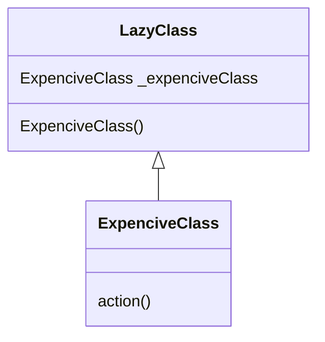
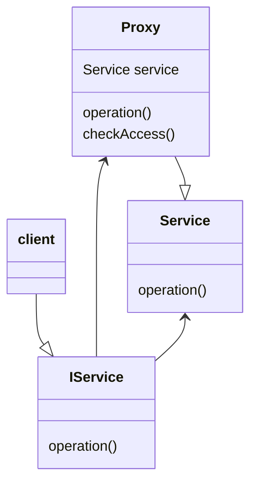

        Lazy initialization
Лінива ініціалізація - це породжувальний патерн дизайну, згідно якого об'єкт повинен створюватись вперше лише тоді, коли метод/властивість цього об'єкта вперше викликається/запитується. Це допомагає обмежити використовувані ресурси, та надавати користувачу лише той функціонал, який йому необхідний.

У даному прикладі ExpenciveClass() буде перевіряти, чи ініціалізоване поле _expenciveClass, і, якщо ні, ініціалізує його, після чого надає доступ до його вмісту.

        Proxy
Проксі - структурний патерн дизайну, що дозволяє змінювати об'єкт, що виконує певні дії, об'єктом, що надає до нього доступ. Це дозволяє відсіювати некоректні запити до оригінального об'єкта, а також зменшувати на нього навантаження. Зазвичай використовується під час створення додатків з доступом до баз даних, серверних додатків, тощо. 

В даному прикладі клієнт запитує доступ до об'єкта-нащадка IService (яким виступає Proxy), і, в залежності від відповіді Proxy, отримує або не отримує доступ до справжнього сервісу Service.

        Strategy
Стратегія - поведінковий патерн дизайну, згідно якого ПЗ повинно створюватись з передбаченням майбутніх розришень. Суть патерну полягає у тому, що б розділіти клас, що робить щось специфічне багатьма способами, на декілька класів-стратегій, що поділяють між собою функціонал. Це забезпечує чистоту та зрозумілість коду, а також полегшує розробку та випуск майбутніх оновлень.
Далі наведений приклад антипатерну. Припустимо у нас є клас Calculation, який має метод Calculate(A,B), що виконує додавання A та B. Проте, ми хочемо розширити цей метод для віднімання, множення та ділення, через що код методу збільшується та стає менш зрозумілим. 
Замість цього ми можемо створити інтерфейс IMethod з методом Calctulate(A,B), та похідні класи Addition, Substraction, Mutliplication та Division, кожен з яких буде реалізовувати Calculate(A,B) відповідно до свого призначення.
```mermaid
classDiagram
Calculation : IMethod calculationMethod
Calculation : Calculate(A,B)
IMethod : Calculate(A,B)
Addition : Calculate(A,B)
Substraction : Calculate(A,B)
Multiplication : Calculate(A,B)
Division : Calculate(A,B)
Calculation *--|>
Addition --> IMethod
Substraction --> IMethod
Multiplication --> IMethod
Division --> IMethod
```

        Monitor Object
Моніторинговий об'єкт - паралелістичний патерн дизайну, згідно з яким необідно інкапсулювати асинхронні методи всередині об'єкта. Це дозволяє обмежувати доступ до ресурсів та забезпечує те, що лише один із потоків одночасно буде мати доступ до перегляду та редагування ресурсів.
